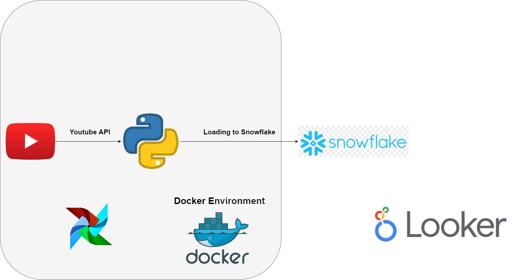

# **YouTube API ETL Process**

In this project, we extract data using YouTube API, processes it with Python, and loads it into a Snowflake database. The ETL pipeline is orchestrated with Apache Airflow and runs inside Docker containers for consistency and scalability. The data is then visualized using Google Looker Studio.

## **Overview**

This ETL pipeline retrieves data from the YouTube API and performs the following steps:

1. **Data Extraction**: Using the YouTube API, video data is fetched.
2. **Data Loading**: The data is inserted into a Snowflake database.
3. **Scheduling & Orchestration**: The entire ETL process is scheduled and monitored with Apache Airflow, running inside Docker containers for easy deployment.
4. **Data Visualization**: Visualize and analyze the data using Google Looker Studio.

